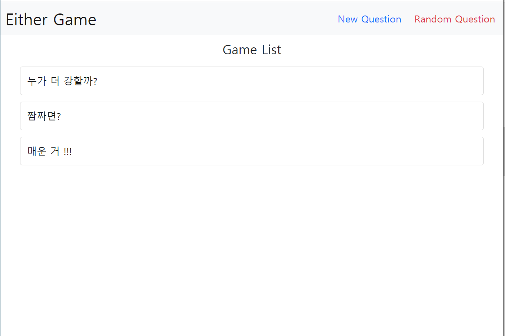

## Either Project

* 요구 사항 
  
  * 투표와 댓글은 생성, 조회 가능하다.
  
  * 투표는 주제와 항목 2개를 가진다.
  
  * 하나의 투표에 여러 댓글이 작성 될 수 있다.
  
  * 투표 항목 중 반드시 하나를 선택해야 댓글을 달 수 있다.
  
  * Random 링크를 클릭하면 투표 조회 페이지가 랜덤으로 렌더링 된다.
  
  * 투표 조회 페이지에서는 항목별 댓글 개수를 통해 두 항목간 선택 비율을 출력한다.

## A. eithers/models.py

```python
from random import choices
from django.db import models

# Create your models here.
class Either(models.Model):
    title = models.CharField(max_length=200)
    issue_a = models.CharField(max_length=200)
    issue_b = models.CharField(max_length=200)

class Comment(models.Model):
    Pick_Red = 'RED'
    Pick_Blue = 'BLUE'
    Pick_Choices = ((Pick_Red, 'RED'), (Pick_Blue, 'BLUE'))
    pick = models.CharField(
        choices=Pick_Choices,
        max_length=4
    )
    content = models.CharField(max_length=200)
    either = models.ForeignKey(Either, on_delete=models.CASCADE)
```

-----

## B. eithers/forms.py

```python
from dataclasses import field, fields
from django import forms
from .models import Either, Comment

class EitherForm(forms.ModelForm):
    title = forms.CharField(
        label='Title',
        widget=forms.Textarea(
            attrs={
                'class': 'my-title form-control',
                'rows': 1,
                'cols': 100,
            }
        )
    )
    issue_a = forms.CharField(
        label='Option A',
        widget=forms.Textarea(
            attrs={
                'class': 'my-title form-control',
                'rows': 1,
                'cols': 100,
            }
        )
    )
    issue_b = forms.CharField(
        label='Option B',
        widget=forms.Textarea(
            attrs={
                'class': 'my-title form-control',
                'rows': 1,
                'cols': 100,
            }
        )
    )
    class Meta:
        model = Either
        fields = '__all__'

class CommentForm(forms.ModelForm):
    class Meta:
        model = Comment
        exclude = ('either', )
```

-----

## C. eithers/views.py

```python
from django.shortcuts import render, redirect
from .models import Either, Comment
from .forms import EitherForm, CommentForm
from django.db import connection
import random

# Create your views here.
def index(request):
    eithers = Either.objects.all()
    random_num = random.randrange(1, len(eithers)+1)
    context = {
        'eithers': eithers,
        'random_num': random_num,
    }
    return render(request, 'eithers/index.html', context)

def create(request):
    if request.method == 'POST':
        form = EitherForm(request.POST)
        if form.is_valid():
            form.save()
            return redirect('eithers:index')
    else:
        form = EitherForm()
    context = {
        'form': form,
    }
    return render(request, 'eithers/create.html', context)

def detail(request, pk):
    either = Either.objects.get(pk=pk)
    comment_form = CommentForm()
    comments = Comment.objects.filter(either=either)

    eithers = Either.objects.all()
    random_num = random.randrange(1, len(eithers)+1)

    cmd = [
        "SELECT COUNT(*) FROM eithers_comment WHERE pick = 'RED' and ",
        "SELECT COUNT(*) FROM eithers_comment WHERE pick = 'BLUE' and ",
        "SELECT COUNT(*) FROM eithers_comment WHERE ",
    ]
    cnt = []
    for c in cmd:
        try:
            cursor = connection.cursor()
            query = c + 'either_id = ' + str(pk)
            result = cursor.execute(query)
            stocks = cursor.fetchall()

            connection.commit()
            connection.close()
        except:
            connection.rollback()
        cnt.append(stocks[0][0])
    if not cnt[2]:
        red_ratio = 50
        blue_ratio = 50
    else:
        red_ratio = round((cnt[0]/cnt[2])*100, 2)
        blue_ratio = round((cnt[1]/cnt[2])*100, 2)

    context = {
        'either': either,
        'comment_form': comment_form,
        'comments': comments,
        'red_ratio': red_ratio,
        'blue_ratio': blue_ratio,
        'random_num': random_num,
    }
    return render(request, 'eithers/detail.html', context)

def comment_create(request, either_pk):
    comment_form = CommentForm(request.POST)
    either = Either.objects.get(pk=either_pk)
    if comment_form.is_valid():
        comment = comment_form.save(commit=False)
        comment.either = either
        comment.save()
        return redirect('eithers:detail', either_pk)
    comments = Comment.objects.filter(either=either)

    context = {
        'comment_form': comment_form,
        'either': either,
        'comments': comments,
    }
    return render(request, 'eithers/detail.html', context)
```

-----

## D. eithers/templates

### 1) index.html

```html
<!-- index.html -->



    <nav class="navbar navbar-expand-lg bg-light" style='height: 80px'>
        <div class="container-fluid">
        <a class="navbar-brand fs-1" href="">Either Game</a>
        <button class="navbar-toggler" type="button" data-bs-toggle="collapse" data-bs-target="#navbarNav" aria-controls="navbarNav" aria-expanded="false" aria-label="Toggle navigation">
            <span class="navbar-toggler-icon"></span>
        </button>
        <div class="collapse navbar-collapse d-flex justify-content-end" id="navbarNav">
            <ul class="navbar-nav">
            <li class="nav-item">
                <a class="nav-link active fs-4 mx-3 text-primary" href="">New Question</a>
            </li>
            <li class="nav-item">
                <a class="nav-link active fs-4 text-danger" href="">Random Question</a>
            </li>
            </ul>
        </div>
        </div>
    </nav>

    <h2 class='d-flex justify-content-center my-3'>Game List</h2>
    
        <div class="list-group mx-5">
            <a href="" class="list-group-item list-group-item-action d-flex align-items-center my-2 fs-4" style='height: 70px'>
              {{ either.title }}
            </a>
          </div>
    

```

### 2) create.html

```html
<!-- create.html -->



<nav class="navbar navbar-expand-lg bg-light" style='height: 80px'>
    <div class="container-fluid">
    <a class="navbar-brand fs-1" href="">Either Game Create</a>
    <button class="navbar-toggler" type="button" data-bs-toggle="collapse" data-bs-target="#navbarNav" aria-controls="navbarNav" aria-expanded="false" aria-label="Toggle navigation">
        <span class="navbar-toggler-icon"></span>
    </button>
    <div class="collapse navbar-collapse d-flex justify-content-end" id="navbarNav">
        <ul class="navbar-nav">
        <li class="nav-item">
            <a class="nav-link active fs-5 mx-4" href="">BACK</a>
        </li>
        </ul>
    </div>
    </div>
</nav>
<div class='d-flex flex-row justify-content-center m-5'>
    <form action="" method='POST'>
      
      
        {{ field.label }}
        <br>
        <div>
          {{ field }}
        </div>
        <br>
      
      <button type='submit' class='btn btn-outline-primary'>Submit</button>
    </form>
</div>

```

### 3) detail.html

```html
<!-- detail.html -->



<nav class="navbar navbar-expand-lg bg-light" style='height: 80px'>
    <div class="container-fluid">
    <a class="navbar-brand fs-1" href="">Either Game</a>
    <button class="navbar-toggler" type="button" data-bs-toggle="collapse" data-bs-target="#navbarNav" aria-controls="navbarNav" aria-expanded="false" aria-label="Toggle navigation">
        <span class="navbar-toggler-icon"></span>
    </button>
    <div class="collapse navbar-collapse d-flex justify-content-end" id="navbarNav">
        <ul class="navbar-nav">
        <li class="nav-item">
            <a class="nav-link active fs-5 mx-4 text-danger" href="">Random Question</a>
        </li>
        <li class="nav-item">
            <a class="nav-link active fs-5 mx-4" href="">BACK</a>
        </li>
        </ul>
    </div>
    </div>
</nav>
<h1 class="d-flex justify-content-center my-5">{{ either.title }}</h1>
<div class="d-flex justify-content-around">
    <h3 class="text-primary">{{ either.issue_a }}</h3>
    <h3 class="text-danger">{{ either.issue_b }}</h3>
</div>
<div class="progress mx-5" style="height: 60px">
    <div class="progress-bar progress-bar-striped" role="progressbar" aria-label="Segment one" style="width: {{ blue_ratio }}%" aria-valuenow="{{ blue_ratio }}" aria-valuemin="0" aria-valuemax="100">{{ blue_ratio }}%</div>
    <div class="progress-bar bg-danger progress-bar-striped" role="progressbar" aria-label="Segment two" style="width: {{ red_ratio }}%" aria-valuenow="{{ red_ratio }}" aria-valuemin="0" aria-valuemax="100">{{ red_ratio }}%</div>
  </div>
<hr>
<h3 class='d-flex justify-content-center'>댓글 작성</h3>
<form action="" method='POST' class='d-flex justify-content-center align-items-center'>
    
    <div class='mx-3'>
        Pick
        <br>
        {{ comment_form.pick }}
    </div>
    <div class='mx-3'>
        content
        <br>
        {{ comment_form.content }}
    </div>
    <div class='mx-5 mt-3'>
    <input type="submit" value='작성'>
    </div>
</form>
<hr>
<h3 class='mx-5 my-3'>댓글 목록</h3>

    
        <div class='list-group bg-danger bg-opacity-25 d-flex justify-content-center my-2 mx-5 px-4' style="height: 50px">
    
        <div class='list-group bg-primary bg-opacity-25 d-flex justify-content-center my-2 mx-5 px-4' style="height: 50px">
    
        {{ comment.content }}
        </div>


```

-----

* 결과



### either/


### either/create/


### either/<pk>/

-----
